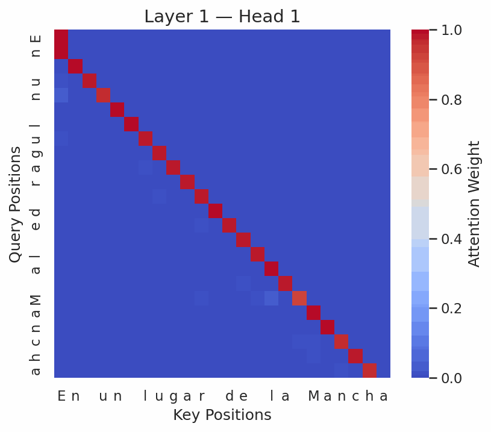

<h1 align="center">
GPT Model from Scratch
</h1>

  

---

## Overview

**GPT Model from Scratch** demonstrates how to build a tiny, character-level GPT model entirely from scratch using PyTorch. Trained on the classic text of **Don Quijote** from [Project Gutenberg](https://www.gutenberg.org/ebooks/2000), this project guides you through data preparation, defining a transformer architecture, training, text generation, and attention visualization—all in a single, self-contained Jupyter Notebook.

---

## Built With

  
  

Leverage the power of **PyTorch** and **Python** to explore the inner workings of transformer models.

---

## What's Inside

- **Data Preparation**  
  Download and encode *Don Quijote* at the character level.
  
- **Transformer Architecture**  
  - **Self-Attention** and **Multi-Head Attention**  
  - **Positional Embeddings**  
  - **Feedforward Layers**  
  - **Layer Normalization**  
  - **Causal Masking** (ensuring the model can’t peek ahead)
  
- **End-to-End Notebook**  
  A single notebook that:
  1. Loads the data  
  2. Defines a GPT-style transformer in pure PyTorch  
  3. Trains the model using a simple loop  
  4. Generates new text  
  5. Visualizes **attention maps** to reveal how tokens interact

---

## Attention Visualization

Experience how the model focuses on different parts of the input sequence during text generation:

  

---

## References

- [**Attention Is All You Need**](https://arxiv.org/abs/1706.03762) — Vaswani et al. (2017)  
- [**GPT-2 & GPT-3**](https://openai.com/research) by OpenAI  
- [**Project Gutenberg**](https://www.gutenberg.org/ebooks/2000) for *Don Quijote*  
- [**The Illustrated Transformer**](http://jalammar.github.io/illustrated-transformer/) by Jay Alammar
